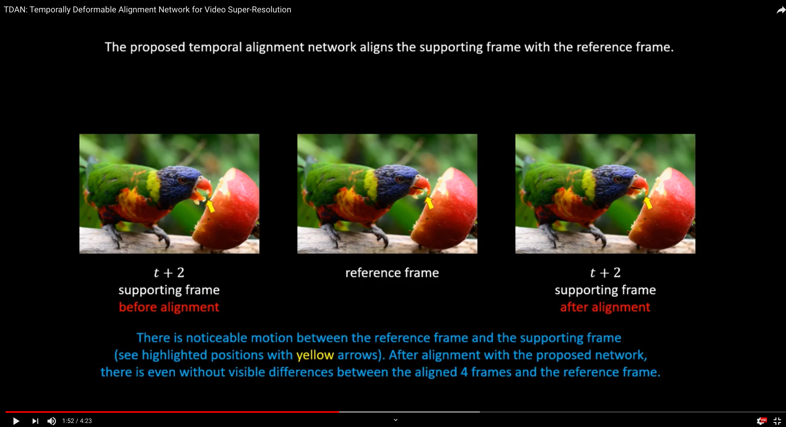

# TDAN-CVPR 2020 （The full code will be released soon!）
This is the official Pytorch implementation of *TDAN: Temporally-Deformable Alignment Network for Video Super-Resolution*. 

#### [Paper](https://arxiv.org/abs/1812.02898) | [Demo Video](https://www.youtube.com/watch?v=eZExENE50I0) 

[](https://www.youtube.com/watch?v=eZExENE50I0)

## Usage

Main dependencies: Python 3.6 and Pytorch-0.3.1 (https://pytorch.org/get-started/previous-versions/)

```bash
$ git clone https://github.com/YapengTian/TDAN-VSR
$ compile deformable convolution functions (may be optional): bash make.sh 
$ pip install -r requirements
$ python eval.py -t test_dataset_path
```

### Citation

If you find the code helpful in your resarch or work, please cite our paper:
```BibTex
@article{tian2018tdan,
  title={Tdan: Temporally deformable alignment network for video super-resolution},
  author={Tian, Yapeng and Zhang, Yulun and Fu, Yun and Xu, Chenliang},
  journal={arXiv preprint arXiv:1812.02898},
  year={2018}
}

@InProceedings{tian2020tdan,
  author={Yapeng Tian, Yulun Zhang, Yun Fu, and Chenliang Xu},
  title={TDAN: Temporally-Deformable Alignment Network for Video Super-Resolution},
  booktitle = {The IEEE Conference on Computer Vision and Pattern Recognition (CVPR)},
  month = {June},
  year = {2020}
}
```

### Resources for deformanble convolution in video restoration

TDAN present a promising framework for deformable alignment, which is shown very effective in video restoration tasks. We are super excited that our works has inspired many well-performing methods. We list a few of them for your potential reference:

* EDVR: Video restoration with enhanced deformable convolutional networks: [paper](https://arxiv.org/abs/1905.02716), [code](https://github.com/xinntao/EDVR)
* Zooming Slow-Mo: Fast and Accurate One-Stage Space-Time VideoSuper-Resolution: [paper](https://arxiv.org/abs/2002.11616), [code](https://github.com/Mukosame/Zooming-Slow-Mo-CVPR-2020)
